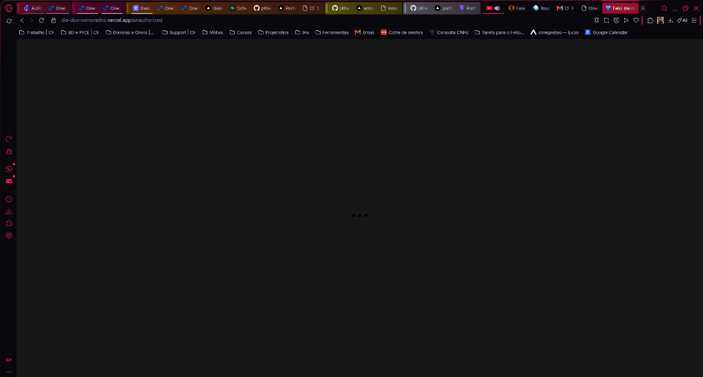
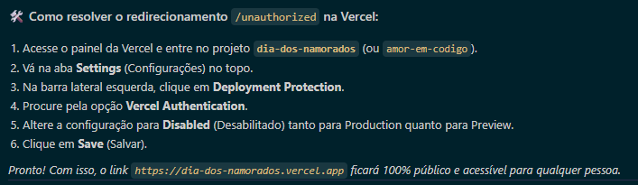

# 💖 Amor em Código — Landing Page Premium & Interativa

> Uma aplicação web interativa, responsiva e de alta qualidade visual, desenvolvida para celebrar marcos especiais e demonstrar conceitos avançados de CSS3, manipulação dinâmica do DOM com Vanilla JavaScript e animações fluidas.

*Nota: Este repositório é um preview técnico do projeto. O código original contém mídias e informações pessoais de uso privado, as quais foram omitidas ou substituídas por placeholders nesta demonstração.*

## 📸 Demonstração Visual

  

  

## 🚀 Tecnologias Utilizadas
- **Estruturação:** HTML5 Semântico
- **Estilização e Animações:** CSS3 (Variáveis nativas, Layouts Flexbox/Grid, Transformações 3D, Transições de Estado)
- **Lógica e Dinâmica:** Vanilla JavaScript (ES6+, manipulação de Date, controle de áudio, observadores de scroll)
- **Hospedagem:** Vercel (CI/CD integrado ao GitHub)

## 🎨 Design System & Estética Visual
- **Harmonia de Cores:** Paleta personalizada em tons HSL leves e acolhedores (tons de lavanda e rosa pastel), projetada para ser elegante, confortável e visualmente atraente.
- **Tipografia Fluida:** Utilização de fontes modernas do Google Fonts para perfeita leitura em múltiplos dispositivos.
- **Efeitos Premium:** Bordas sutis, efeitos de glassmorphism (`backdrop-filter`) e interações de hover suaves.

## 🛠️ Principais Implementações Técnicas
1. **Contador de Tempo Dinâmico (Love Counter):**
   - Lógica em JS utilizando a API nativa de `Date`.
   - Cálculo preciso e atualização em tempo real (anos, meses, dias, horas, minutos e segundos).
   - Sem dependência de bibliotecas externas, garantindo performance máxima.

2. **Linha do Tempo Interativa (Love Timeline):**
   - Estrutura cronológica animada com transições acionadas via rolagem de página (scroll-triggered events).
   - Uso de `IntersectionObserver` para otimização de renderização e animações suaves na viewport.

3. **Envelopes Virtuais Interativos:**
   - Elementos interativos em HTML/CSS que simulam a abertura física de cartas através de transformações 3D no hover/click.

4. **Galeria Polaroid:**
   - Renderização de blocos no formato Polaroid clássico com pequenos desvios de rotação randômicos e sombras suaves (box-shadow).

5. **Trilha Sonora Customizada:**
   - Player de música integrado ao layout utilizando a Web Audio API nativa para reproduzir e pausar trilha sonora sob demanda do usuário.
